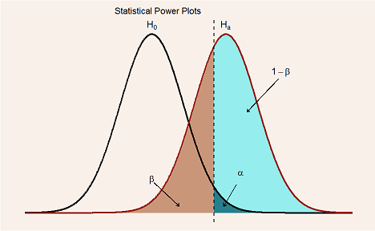
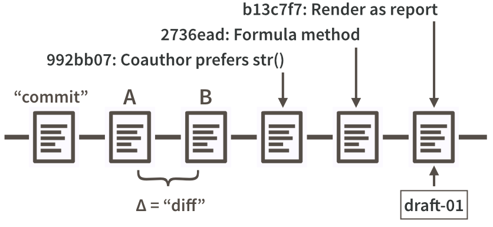

```{r library, include = F}
library(tidyverse)
library(gapminder)
```

# [Chapters 1-32](file:///C:/Users/stoch/OneDrive/Files_CDEF/myRfiles/Stat545/Stat545_1.html) and [33-42](file:///C:/Users/stoch/OneDrive/Files_CDEF/myRfiles/Stat545/Stat545_2.html)  



* [Tips for working with images and figures in R Markdown](http://zevross.com/blog/2017/06/19/tips-and-tricks-for-working-with-images-and-figures-in-r-markdown-documents/)
* [Useful tricks when including images in Rmarkdown](https://blog.revolutionanalytics.com/2017/06/rmarkdown-tricks.html/)
* [Power](https://en.wikipedia.org/wiki/Power_(statistics))
* [Sensitivity and Specificity](https://en.wikipedia.org/wiki/Sensitivity_and_specificity)

# [Git and GitHub](https://happygitwithr.com/)

__Register a GitHub account__ [here](https://github.com). It’s free!


## Install Git

__Check if Git is already installed__  
_From the Shell or Git Bash:_  
<scan style="font-family: Courier; font-size:11pt; color:teal; font-weight: bold">
&emsp; echo $SHELL     &ensp; # /usr/bin/bash  
&emsp; git \--version         # git version 2.23.0.windows.1
</scan>  

__Install Git__

Install [Git for Windows](https://git-for-windows.github.io/), also known as msysgit or “Git Bash”, to get Git and also some other useful tools, such as the Bash shell.  
Git will be installed in C:/Program Files/Git/bin/git.exe unless instructed otherwise.  
This also installs a Git client (usually Vim) which can be replaced later with a better one.  

__Specify your user name and email for Git__

_From the Shell or Git Bash:_  
<scan style="font-family:Courier; font-size:11pt; color:teal; font-weight:bold">
&emsp; git config \--global user.name 'Geo4ai'  
&emsp; git config \--global user.email 'xyz@example.com'  
&emsp; git config \--global \--list  
</scan>


## Install a Git client

“Git” is just a collection of individual commands you execute in the shell. This interface is not the most useful. A client with a graphical interface is more efficient. RStudio offers a very basic Git client via its Git pane.  
Some of the  other more powerful GUIs are:  
[GitKraken](https://www.gitkraken.com/), [SourceTree](https://www.sourcetreeapp.com/), [SmartGit](http://www.syntevo.com/smartgit/), or [GitHub Desktop](https://desktop.github.com/) which comes when installing GitHub.  
<br>  


# [Connect Git, GitHub, and  RStudio](https://happygitwithr.com/connect-intro.html)

## Connect to GitHub

Go to [GigHub](https://github.com), log in and read the [GitHub Guides](https://guides.github.com/).  

### Make a repo on GitHub

Click the green “New repository” button, or on “Repositories”, then click the green “New” button. Then fill-in the fields:  

* Repository name: myrepo (or whatever you wish, we’ll delete this soon anyway).
* Description: “testing my setup” (or whatever, but some text is good for the README).
* Public.
* YES Initialize this repository with a README.  
For everything else, just accept the default.

Click the big green button “Create repository.”  
Copy the HTTPS clone URL to your clipboard via the green “Clone or Download” button.

### Clone the repo to your local computer

Verify that you are in the right directory with _pwd_, and show the root directoty with _~/_ .  
Paste the URL from the clipboard to complete the _clone_ command.  
<scan style="font-family: Courier; font-size:11pt; color:teal; font-weight: bold">
&emsp; git clone https://github.com/YOUR-username/YOUR-repository.git  

emsp; git status  
</scan>   

Make this new repo your working directory, list its files, display the README, and get some information on its connection to GitHub:  
<scan style="font-family: Courier; font-size:11pt; color:teal; font-weight: bold">
&emsp; cd myrepo  
&emsp; ls   
&emsp; head README.md  
&emsp; git remote show origin   
</scan>  

### Make a local change, commit, and push
 
Add a line to README and verify that Git notices the change:  
<scan style="font-family: Courier; font-size:11pt; color:teal; font-weight: bold">
&emsp; git echo "A line I wrote on my local computer" >> README.md  
&emsp; git status  
</scan>   

Stage (meaning __and__) and __commit__ this change and __push__ to the remote repo on GitHub.  
<scan style="font-family: Courier; font-size:11pt; color:teal; font-weight: bold">
&emsp; add -A  
&emsp; git commit -m "A commit from my local computer"  
&emsp; git push  
</scan>
Git requires a commit message for every commit which must follow the -m flag.  

This command reveals the current line ending configuration and a typical output on Windows:  
<scan style="font-family: Courier; font-size:11pt; color:teal; font-weight: bold">
&emsp; git config \--show-origin \--get core.autocrlf   &emsp; # true
</scan>   

### Confirm the local change propagated to the GitHub remote

Refresh the GitHub web page in the bowser.  
The change “A line I wrote on my local computer” should apear in the README file.  
Click on “commits” to see the message “A commit from my local computer.”  

Now we are ready to use Git and GitHub with RStudio.  


### Type the GitHub username and password on each push?

The GitHub credentials are usually cached when you successfully make the first __push__ and apply across to all repos.  

### Clean up

* __Local__  
When you’re ready to clean up, you can delete the local repo. It’s just another directory on your computer.  
In the Shell or Git Bash, if the current working directory is myrepo:  
<scan style="font-family: Courier; font-size:11pt; color:teal; font-weight: bold">
&emsp; cd ..  
&emsp; rm -r myrepo  
&emsp; # or  rm -rf myrepo/  
</scan>   

* __GitHub__  
In the browser, go to your repo’s landing page on GitHub. Click on “Settings”,  Scroll down, and click on “delete repository”.  


## Cache credentials for HTTPS

As of January 2019, Git will use a credential helper provided by the operating system. That is, you may not need to do anything special in order to cache your GitHub username and password.  

This command shows the configuration and the output in a new installation of Git for Windows:  
<scan style="font-family: Courier; font-size:11pt; color:teal; font-weight: bold">
&emsp; git config \--show-origin \--get credential.helper  
&emsp; # file:C:/Program Files/Git/mingw64/etc/gitconfig manager  
</scan>   

### Special consideration for two-factor authentication

If you are using two-factor authentication (a.k.a. “2FA”) with GitHub, you will not be able to use your GitHub password via HTTPS. 2FA users should probably be using SSH.  

If you really want to use HTTPS, you must enter a personal access token in lieu of your password. This is the same type of PAT you could use to access the GitHub API and that many R users define in .Renviron as the environment variable GITHUB_PAT.  

### A test repository

Use a functioning test Git repository on GitHub, e.g. the "hello-world" repo developed earlier, and make sure it is cloned locally and it is tracking the remote.  

In the working directory set to the local Git repo, enter:  
<scan style="font-family: Courier; font-size:11pt; color:teal; font-weight: bold">
&emsp; git remote -v  
&emsp; # origin  https://github.com/Your-username/hello-world.git (fetch)  
&emsp; # origin  https://github.com/Your-username/hello-world.git (push)  
</scan>   

Next confirm that the local master branch is tracking your GitHub master branch (origin/master).   
<scan style="font-family: Courier; font-size:11pt; color:teal; font-weight: bold">
&emsp; git branch -vv  
&emsp; # master bf9562f [origin/master] Merge pull request #1 from ...  
</scan>   

### Verify that your Git is new enough to have a credential helper

<scan style="font-family: Courier; font-size:11pt; color:teal; font-weight: bold">
&emsp; git \--version  
&emsp; # It should be 1.7.10 or newer, if not update Git or use SSH keys.  
&emsp; # git version 2.23.0.windows.1 was my version when this was written.  
</scan>   

### Turn on the credential helper

Git for Window ships with credential.helper configured to use Git Credential Manager for Windows. For older Git versions this command sets it explicitly:  
<scan style="font-family: Courier; font-size:11pt; color:teal; font-weight: bold">
git config \--global credential.helper manager  
</scan>   

### Trigger a username / password challenge

Make sure you are in the repo directory. Change a file in the local "hello-world" repo and commit it.  
<scan style="font-family: Courier; font-size:11pt; color:teal; font-weight: bold">
&emsp; echo " add a trigger change ." >> README.md  
&emsp; git commit -m "a commit to trigger the password"  
&emsp; git add -A  
&emsp; git push -u origin master  
&emsp; # _One last time you may be asked for your username and password._  
&emsp; git push  
&emsp; # _You should NOT be asked for your username and password again._  
&emsp; # _Everything up to date._  
</scan>   

## Set up keys for SSH

Revisit this section when a SSH key is needed.  

## Detect Git from RStudio

Let’s check if RStudio can find the Git executable.

* File > New Project.  Do you see an option to create from Version Control? If yes, good.
* Select New Directory > New Project. 
* Do you see a checkbox “Create a git repository”? If yes, good, CHECK IT.
* Name this disposable project Test9 and click Create Project. 
* Do you see a “Git” tab in the upper right pane, the same one that has “Environment” and “History”? If yes, good.
* Delete this project. RStudio and Git are talking to each other.  

### Where is the Git executable installed?

From RStudio, go to Tools > Global Options > Git/SVN and make sure that the box Git executable points to your Git executable.  
C:/Program Files/Git/bin/git.exe  
<scan style="font-family: Courier; font-size:11pt; color:teal; font-weight: bold">
&emsp; where git  
</scan>   


## Dysfunctional PATH

PATH is the set of directories where your computer will look for executables, such as Git or make.  

<scan style="font-family: Courier; font-size:11pt; color:teal; font-weight: bold">
echo $PATH  
</scan>   

[Instructions](http://www.troubleshooters.com/linux/prepostpath.htm) on what to put in your .bash_profile in order to add a directory to PATH.  

## Recommendations

Is your Git repo / RStudio Project inside a folder that … eventually rolls up to Google Drive, DropBox, Microsoft OneDrive, or a network drive? If yes, I recommend you move the repo / Project into a plain old directory that lives directly on your computer.  

Do not create a Git repository inside another Git repository.  


# Get started with GitHub - [Early GitHub Wins](https://happygitwithr.com/usage-intro.html)

Having completed and verified the Git/GitHub/RStudio setup, in the next sections we focus on building the workflows to get our work onto GitHub.  

## New project, GitHub first

We create a new Project, with the preferred “GitHub first, then RStudio” sequence. This approach of copying the Project from GitHub to the local computer also sets up the local Git repository for immediate pulling and pushing. Under the hood, we are actually doing git clone.  


[Current HappyGit](file:///C:/Users/stoch/OneDrive/Files_CDEF/myRfiles/Stat545/HappyGit.html)

### Make a repo on GitHub

Click the green “New repository” button, or on “Repositories”, then click the green “New” button. Then fill-in the fields:  

* Repository name: repo99 (or whatever).
* Description: “the repo99 workflow” (or whatever to describe the project).
* Public.
* YES Initialize this repository with a README.
* Click the big green button “Create repository.”  
* Copy the HTTPS clone URL to your clipboard via the green “Clone or Download” button.

### New RStudio Project via git clone

In RStudio, start a new Project:  

* File > New Project > Version Control > Git. In the “repository URL” paste the URL of your new GitHub repository.  
It will be something like this https://github.com/username/repo99.git
* Be intentional about where you create this Project, preferably “open in a new session”.
* Click “Create Project” to create a new directory, which is all of the following:  
  - a directory or “folder” on your computer
  - a local Git repository, linked to a remote GitHub repository
  - an RStudio Project
* Barring any of other limitation, all R projects should have exactly this set-up.  

This should download the README.md file that we created on GitHub in the previous step.  
Look in RStudio’s file browser pane for the README.md file.  

There’s a big advantage to the “GitHub first, then RStudio” workflow: the remote GitHub repo is added as a remote for the local repo and the local master branch is now tracking master on GitHub. This is a technical but important point about Git. The practical implication is that we are now set up to push and pull. It's not necessary to set up Git remotes and tracking branches on the command line.  

Have a look under the hood:  
<scan style="font-family: Courier; font-size:11pt; color:teal; font-weight: bold">
git remore -v  
git remote \--verbose  
git branch -vv  
</scan>   

### Make local changes, save, commit

Do this every time you finish a valuable chunk of work, probably many times a day.  

From RStudio, modify the README.md file by adding the line “This is a line from RStudio”. Save the changes.  

Commit these changes to your local repo.  

* Click the “Git” tab in upper right pane
* Check “Staged” box for any files whose modifications you want to commit.
  - To see what’s changed since the last commit, click on “Diff” for a Git pop-up
* If you’re not already in the Git pop-up, click “Commit”
* Type a message in Commit message, such as “Commit from RStudio”.
* Click “Commit”

### Push the local changes to GitHub

Do this a few times a day, but possibly less often than you commit.  
There new work in the local Git repository, but the changes are not online yet.  

First __establish a habit__ to pull from before you push to GitHub. Why?  
If you make changes to the repo in the browser or from another machine or a collaborator has pushed, these changes should be pulled in before a push.  

Click the blue “Pull” button in the “Git” tab in RStudio. You’ll get the message “Already up-to-date.”  
Click the green “Push” button to send the local changes to GitHub.  

### Confirm the local change propagated to the GitHub remote

Click Refresh in the browser GitHub page.  
You should see the new “This is a line from RStudio” in README.  
If you click on “commits,” you should see the message “Commit from RStudio”.  

### Make a change on GitHub

Click on README.md in the file listing on GitHub.  
In the upper right corner, click on the pencil for “Edit this file”.  
Add a line to this file, such as “Line added from GitHub.”  
Edit the commit message in “Commit changes” or accept the default.  
Click the big green button “Commit changes.”  

### Pull from GitHub into RStudio

Back in RStudio locally …  
Inspect the README.md. It should NOT have the line “Line added from GitHub”.  
Click the blue Pull button.  
Look at README.md again. You should now see the new line now.  
<br>

## Existing project, GitHub first

In this section we build a workflow to bring an existing R project into RStudio and Git/GitHub.  
We assume we have an existing R project isolated in a directory on local computer. If that’s not true, we create a directory and put anything it it.   

### Make a repo on GitHub

Create a new repo on GitHub, name it "repo88", and copy the URL.  

### New RStudio Project via git clone

create a new Git project in RStudio and paste the URL from the previous step.  
This should download the README.md file that we created on GitHub and should appear in the RStudio file pane.  

### Bring the existing project over to the new directory in RStudio

Using your favorite method of moving or copying files, copy the files that constitute the existing project into the directory for this new project. Check the Git pane and the file browser In RStudio.  

* All the files should be there if the move/copy was successful.
* Are they showing up in the Git pane with questions marks? They should be appearing as new untracked files.  

### Stage and commit

Commit the files to this repo.  

* Click the “Git” tab in upper right pane
* Check “Staged” box for all files you want to commit.
  - Default: stage it.
  - All files will go to GitHub. So consider if that is appropriate for each file. You can absolutely keep a file locally, without committing it to the Git repo and sending to GitHub. Just let it sit there in your Git pane, without being staged. If this is a long-term situation, list the file in .gitignore.
* If you’re not already in the Git pop-up, click “Commit”
* Type a message in “Commit message”, such as “init”
* Click “Commit”  

### Push the local changes to GitHub

Click the green “Push” button to send the local changes to GitHub.  

### Confirm the local change propagated to the GitHub remote

Go back to the browser and Refresh GitHum. All the committed project files should there.  

## Existing project, GitHub last

An example when this approach may be preferred is an existing project that is already a Git repo with a history we care about.  

There are more opportunities to make mistakes with this approach. RStudio and the __*usethis*__ package are making this task easier so we can avoid working with Git in the shell, but command line Git remains a viable option.  

### Make or verify an RStudio Project

There should be an existing R project isolated in a directory on the computer.  
If it’s not already an RStudio Project, make it so:

* If you use the _usethis_ package, set the existing directory as the current project with usethis::create_project().
* Within RStudio you can do: File > New Project > Existing Directory and, if you wish, “Open in new session”.  
If your project is already an RStudio Project, launch it.  

### Make or verify a Git repo

You should be in RStudio now, in your project.

Is it already a Git repository? The presence of the Git pane should tip you off. If yes, you’re done.  

If not, you have several options:

* If you have the _usethis_ package, call usethis::use_git().
* In RStudio, go to Tools > Project Options … > Git/SVN. Under “Version control system”, select “Git”.  
Confirm New Git Repository? Yes!
* In the shell, in Project’s directory, do git init.
If you used RStudio or usethis, the Project should re-launch in RStudio.  
Do that yourself if you did git init. RStudio should now have a Git pane.  

### Stage and commit

If your local project was already a Git repo and was up-to-date, move on. Otherwise, you probably need to stage and commit.

* Click the “Git” tab in upper right pane
* Check “Staged” box for all files you want to commit.
  - Default: stage everything
  - When to do otherwise: this will all go to GitHub. So consider if that is appropriate for each file. You can absolutely keep a file locally, without committing it to the Git repo and sending to GitHub. Just let it sit there in your Git pane, without being staged. No harm will be done. If this is a long-term situation, list the file in .gitignore.
* If you’re not already in the Git pop-up, click “Commit”
* Type a message in “Commit message”.
* Click “Commit”

### Make and connect a GitHub repo, option 1

If you use the [usethis](https://cran.r-project.org/package=usethis) package AND you have configured a GitHub Personal Access Token (PAT) (see the appendix for how to set this up.), do this in R:  

<scan style = "font-family:Courier; color:teal; font-weight:bold" >
usethis::use_github()  
</scan>   

This will create a new repo on GitHub, add it as a remote, set up a tracking branch, and open it in your browser. Read the use_github() help to learn about its arguments and advice on configuring a PAT. This is extremely handy for a variety of workflows that call the GitHub API. Consider setting this up if you use usethis, devtools, or gh regularly.  

### Make and connect a GitHub repo, option 2

#### Make a new repo on GitHub

Go to https://github.com and make sure you are logged in.  

Click the green “New repository” button. Or, if you are on your own profile page, click on “Repositories”, then click the green “New” button.  

Pick a repository name – it should probably match the name of your local Project and directory.  

Public or private, as appropriate  
DO NOT initialize this repository with a README.  

Click the big green button “Create repository.”  

Copy the HTTPS clone URL to your clipboard via the green “Clone or Download” button, or copy the SSH URL if you chose to set up SSH keys.  


#### Connect local repo to GitHub repo in the Shell or in Rstudio

##### In RStudio
Click on the “two purple boxes and a white square” in the Git pane. Click “Add remote”. Paste the URL here and pick a remote name, almost certainly origin. Now “Add”.  
We should be back in the “New Branch” dialog (if not, click on the “two purple boxes and a white square” in the Git pane again). I assume you’re on the master branch want it to track master on GitHub. Enter master as the branch name and make sure “Sync branch with remote” is checked. Click “Create” (eventhough the branch already exists). In the next dialog, choose “overwrite”.  

##### In the shell

<scan style = "font-family:Courier; color:teal; font-weight:bold" >
git remote add origin https://github.com/username/reponame.git  
</scan>   

Push the tracking relationship between the local master branch and master on GitHub:  
<scan style = "font-family:Courier; color:teal; font-weight:bold" >
git push --set-upstream origin master  
</scan>   

### Confirm the local files propagated to the GitHub remote

Go back to the browser and Refresh the page.  
You should see all the project files you committed there.  
If this project already had a Git history, it should be reflected on GitHub.  
<br>

## [Test drive R Markdown](https://happygitwithr.com/rmd-test-drive.html)

We will author an R Markdown document and render it to HTML. We discuss how to keep the intermediate Markdown file, the figures, and what to commit to Git and push to GitHub. If GitHub is the primary venue, we render directly to GitHub-flavored markdown and never create HTML.

Here is the official R Markdown documentation: http://rmarkdown.rstudio.com  

### Hello World

We’ll practice with RStudio’s boilerplate R Markdown document.  
Launch RStudio in a Project that is a Git repo that is connected to a GitHub repo.  

Do this: File > New File > R Markdown …  

* Give it an informative title. This will appear in the document but does not necessarily have anything to do with the file’s name. The title is for humans, so it can contain spaces and punctuation. The filename is for humans and computers, so it should have similar words in it but no spaces and no punctuation.  
* Accept the default Author or edit if you wish.  
* Accept the default output format of HTML.  
* Click OK.  
Save this document to a reasonable filename and location. The filename should end in .Rmd or .rmd. Save in the top-level of this RStudio project and Git repository, that is also the current working directory.  

You might want to commit here, so you can see what’s about to change …  

Click on “Knit HTML” or do File > Knit Document. RStudio should display a preview of the resulting HTML. Also look at the file browser. You should see the R Markdown document, i.e. foo.Rmd AND the resulting HTML foo.html.  

Congratulations, you’ve just made your first reproducible report with R Markdown. You might want to commit here.  

### Push to GitHub

Push the current state to GitHub and visit it in the browser.  

Do you see the new files? An R Markdown document and the associated HTML? Visit both in the browser.  

Verify this: Rmd is quite readable. But the output is obviously not there. HTML is ugly.  

### Output format


### d


### e


### f

<scan style = "font-family:Courier; color:teal; font-weight:bold" >
   &emsp; git  
</scan>   


## Render an R script


### Morph R Markdown into a renderable R script


### Write a render-ready R script


<scan style = "font-family:Courier; color:teal; font-weight:bold" >
&emsp; git  
&emsp; git  
</scan>   

<br>


# [Git Funddamentals](https://happygitwithr.com/git-intro.html)

Actual usage, in the course of work, is the most effective way to build up a useful mental model for Git. In this section, we strive to introduce the most important basic ideas using guided activities. Self-learners can achieve the same by working through the guided activities in the previous sections.  
Now is the perfect time to explicitly define some Git vocabulary. This will also help to link Git concepts to data science tasks and projects.  

## Repo, commit, diff, tag -20

### Repos or repositories

Git is a version control system whose original purpose was to help groups of developers work collaboratively on big software projects. Git manages the evolution of a set of files – called a repository or repo – in a highly structured way. Historically, these files would have consisted of source code and the instructions for how to build an application from its source.  

Git has been re-purposed by the data science community (Ram 2013; Bartlett 2016; Perez-Riverol et al. 2016). We use it to manage the motley collection of files that make up typical data analytical projects, which consist of data, figures, reports, and, yes, some source code.  

For new or existing projects, we recommand that you:

* Dedicate a local directory or folder to it.
* Make it an RStudio Project. Optional but recommended; obviously only applies to projects involving R and users of RStudio.
* Make it a Git repository.
This setup happens once per project and can happen at project inception or at any later point. Chances are your existing projects each already live in a dedicated directory. Making such a directory an RStudio Project and Git repository boils down to allowing those applications to leave notes for themselves in hidden files or directories. The project is still a regular directory on your computer, that you can locate, name, move, and generally interact with as you wish. You don’t have to handle it with special gloves!

The daily workflow is probably not dramatically different from what you do currently. You work in the usual way, writing R scripts or authoring reports in LaTeX or R Markdown. But instead of only saving individual files, periodically you make a commit, which takes a snapshot of all the files in the entire project. If you have ever versioned a file by adding your initials or the date, you have effectively made a commit, albeit only for a single file. It is a version that is significant to you and that you might want to inspect or revert to later. Periodically, you push commits to GitHub. This is like sharing a document with colleagues on DropBox or sending it out as an email attachment. By pushing to GitHub, you make your work and all your accumulated progress accessible to others.  

This is a moderate change to your normal, daily workflow. It feels weird at first, but quickly becomes second nature. In STAT 545 students are required to submit all coursework via GitHub, starting in week one. Most have never seen Git before and do not identify as programmers. It is a major topic in class and office hours for the first two weeks. Then we practically never discuss it again.  
This part collects anything we’ve written about core Git concepts. It is a work in progress and is conceived as a complement to the many excellent external resources for Git.  


### Commits, diffs, and tags

We now connect the fundamental concepts of Git to the data science workflow:  

* repository
* commit
* diff

Recall that a repository or repo is just a directory of files that Git manages holistically. A commit functions like a snapshot of all the files in the repo, at a specific moment. Under the hood, that is not exactly how Git implements things. Although mental models don’t have to be accurate in order to be useful, in this case it helps to align the two.  

#### Control the Imbeded graph
```{r InsGraph3, echo=F, fig.align = 'center', out.width = "60%", fig.cap = "Partial commit history for Iris example"}
knitr::include_graphics(here::here("Figure20.png"))
# 
# knitr::include_graphics("C:/Users/stoch/OneDrive/Files_CDEF/myRfiles//Stat545/Figure20.png")
```

Figure 20.1 is a look at a fictional analysis of the iris data, focusing on the evolution of a script, iris.R. Consider version A of this file and a modified version, version B. Assume that version A was part of one Git commit and version B was part of the next commit. The set of differences between A and B is called a “diff” and Git users contemplate diffs a lot. Diff inspection is how you re-explain to yourself how version A differs from version B. Diff inspection is not limited to adjacent commits. You can inspect the diffs between any two commits.  

In fact, Git’s notion of any specific version of iris.R is as an accumulation of diffs. If you go back far enough, you find the commit where the file was created in the first place. Every later version is stored by Git as that initial version, plus all the intervening diffs in the history that affect the file. We’ll set these internal details aside now, but understanding the importance of these deltas will make Git’s operations less baffling in the long run.  

So, by looking at diffs, it’s easy to see how two snapshots differ, but what about the why?  

Every time you make a commit you must also write a short commit message. Ideally, this conveys the motivation for the change. Remember, the diff will show the content. When you revisit a project after a break or need to digest recent changes made by a colleague, looking at the history, by reading commit messages and skimming through diffs, is an extremely efficient way to get up to speed. Figure 20.1 shows the messages associated with the last three commits.  

Every commit needs some sort of nickname, so you can identify it. Git does this automatically, assigning each commit what is called a SHA, a seemingly random string of 40 letters and numbers (it is not, in fact, random bu is a SHA-1 checksum hash of the commit). Though you will be exposed to these, you don’t have to handle them directly very often and, when you do, usually the first 7 characters suffice. The commit messages in Figure 20.1 are prefixed by such truncated SHAs. You can also designate certain snapshots as special with a tag, which is a name of your choosing. In a software project, it is typical to tag a release with its version, e.g., “v1.0.3”. For a manuscript or analytical project, you might tag the version submitted to a journal or transmitted to external collaborators. Figure 20.1 shows a tag, “draft-01”, associated with the last commit.  

## Git Commands-21

New local git repo from a repo on GitHub:  
<scan style = "font-family:Courier; color:teal; font-weight:bold" >
&emsp; git clone https://github.com/username/happy-git-with-r.git  
</scan>   

Check the remote was cloned successfully:  
<scan style = "font-family:Courier; color:teal; font-weight:bold" >
&emsp; git remote --verbose  
</scan>   

Stage local changes, commit:  
<scan style = "font-family:Courier; color:teal; font-weight:bold" >
&emsp; git add foo.txt  
&emsp; git commit --message "A commit message"git commit --message "A commit message"  
</scan>   

Check on the state of the Git world:  
<scan style = "font-family:Courier; color:teal; font-weight:bold" >
&emsp; git status  
&emsp; git log  
&emsp; git log --oneline  
</scan>   

Compare versions:  
<scan style = "font-family:Courier; color:teal; font-weight:bold" >
&emsp; git diff  
</scan>   

Add a remote to existing local repo:  
<scan style = "font-family:Courier; color:teal; font-weight:bold" >
&emsp; git remote add origin https://github.com/username/happy-git-with-r  
&emsp; git remote --verbose  
&emsp; git remote show origin  
</scan>   

Push local master to GitHub master and have local master track master on GitHub:  
<scan style = "font-family:Courier; color:teal; font-weight:bold" >
&emsp; git push --set-upstream origin master  
&emsp; ## shorter form  
&emsp; git push -u origin master  
&emsp; ## you only need to set upstream tracking once!  
</scan>   

Regular push:  
<scan style = "font-family:Courier; color:teal; font-weight:bold" >
&emsp; git push  
&emsp; ## the above usually implies (and certainly does in our tutorial)  
&emsp; git push origin master  
&emsp; ## git push [remote-name] [branch-name]  
</scan>   

Pull commits from GitHub:  
<scan style = "font-family:Courier; color:teal; font-weight:bold" >
&emsp; git pull  
</scan>   

Pull commits and don’t let it put you in a merge conflict pickle:  
<scan style = "font-family:Courier; color:teal; font-weight:bold" >
&emsp; git pull --ff-only  
</scan>   

Fetch commits  
<scan style = "font-family:Courier; color:teal; font-weight:bold" >
&emsp; git fetch  
</scan>   

Switch to a branch  
<scan style = "font-family:Courier; color:teal; font-weight:bold" >
&emsp; git checkout [branch-name]  
</scan>   

Checking remote and branch tracking  
<scan style = "font-family:Courier; color:teal; font-weight:bold" >
&emsp; git remote -v  
&emsp; git branch -vv  
</scan>   


## Branches-22

Branching means that you take a detour from the main stream of development and do work without changing the main stream. It allows one or many people to work in parallel without overwriting each other’s work.  

### Create a new branch

We can create a new branch with _git branch_, then checkout the branch with _git checkout_. To distinguish it from the main stream of development, presumably on master, we’ll call this a “feature branch”.  

<scan style = "font-family:Courier; color:teal; font-weight:bold" >
git branch issue-5  
git checkout issue-5  
</scan>   

### Switching Branches

use _git checkout_ to switch between branches.  

### Merging a Branch

Once you have done your work and committed it to the feature branch, you can switch back to master and merge the feature branch.  

<scan style = "font-family:Courier; color:teal; font-weight:bold" >
git checkout master  
git merge issue-5  
</scan>   

### Dealing with Conflict
The first step to solving a merge conflict is determining which files are in conflict, which you can do with _git status_  

[Git Basic Branching and Merging](https://git-scm.com/book/en/v2/Git-Branching-Basic-Branching-and-Merging)  

## Remotes-23

Remote repositories are versions of your project that are hosted on the Internet or another network. A single project can have 1, 2 or even hundreds of remotes. You pull others changes from remotes and push your changes to remotes.  

### List Existing Remotes

_git remote_ lists the names of available remotes, but usually it is more useful to see what URLs each note corresponds to (with -v).  

<scan style = "font-family:Courier; color:teal; font-weight:bold" >
git remote -v  
</scan>   

### Adding a new remote

_git clone_ automatically adds a new remote, so often you do not need to do this manually initially. However, after the initial clone, it is often useful to add additional remotes.  

Use _git remote add_ to add a new remote  

<scan style = "font-family:Courier; color:teal; font-weight:bold">
git remote add happygit https://github.com/forum4ai/545git.git  
</scan>   

Note: when you add a remote you give it a nickname (here happygit), which you can use in git commands in place of the entire URL.  

<scan style = "font-family:Courier; color:teal; font-weight:bold">
git fetch 545git  
</scan>   

Sidebar on nicknames: there is a strong convention to use origin as the nickname of your main remote. At this point, it is common for the main remote of a repo to be hosted on GitHub (or GitLab or Bitbucket). It is tempting to use a more descriptive nickname (such as github), but you might find that following convention is worth it. It makes your setup easier for others to understand and for you to transfer information that you read in documentation, on Stack Overflow, or in blogs.  
  
A common reason to add a second remote is when you have done a “fork and clone” of a repo and your personal copy is set up as the origin remote. Eventually you will want to pull changes from the original repository. It is common to use upstream as the nickname for this remote.  

### c


### d

<scan style = "font-family:Courier; color:teal; font-weight:bold" >
&emsp; git  
</scan>   


### e


[See also Working with Remotes](https://git-scm.com/book/en/v2/Git-Basics-Working-with-Remotes)  


# [Daily Workflows](https://happygitwithr.com/workflows-intro.html)


## The Repeated Amend-24


### a

<scan style = "font-family:Courier; color:teal; font-weight:bold" >
&emsp; git  
</scan>   

### b


### c

<scan style = "font-family:Courier; color:teal; font-weight:bold" >
&emsp; git  
</scan>   

### d


## Dealing with push rejection-25


### a

<scan style = "font-family:Courier; color:teal; font-weight:bold" >
&emsp; git  
</scan>   

### b


### c

<scan style = "font-family:Courier; color:teal; font-weight:bold" >
&emsp; git  
</scan>   

### d


## Pull, but you have local work-26


### a

<scan style = "font-family:Courier; color:teal; font-weight:bold" >
&emsp; git  
</scan>   

### b


### c

<scan style = "font-family:Courier; color:teal; font-weight:bold" >
&emsp; git  
</scan>   

### d


## Time travel: See the past-27


### a

<scan style = "font-family:Courier; color:teal; font-weight:bold" >
&emsp; git  
</scan>   

### b


### c

<scan style = "font-family:Courier; color:teal; font-weight:bold" >
&emsp; git  
</scan>   

### d


## [Fork and clone-28](https://happygitwithr.com/fork-and-clone.html)


### a

<scan style = "font-family:Courier; color:teal; font-weight:bold" >
&emsp; git  
</scan>   

### b


### c

<scan style = "font-family:Courier; color:teal; font-weight:bold" >
&emsp; git  
</scan>   

### d


## Get upstream changes for a fork-29


### a

<scan style = "font-family:Courier; color:teal; font-weight:bold" >
&emsp; git  
</scan>   

### b


### c

<scan style = "font-family:Courier; color:teal; font-weight:bold" >
&emsp; git  
</scan>   

### d


## Explore and extend a pull request-30


### a

<scan style = "font-family:Courier; color:teal; font-weight:bold" >
&emsp; git  
</scan>   

### b


### c

<scan style = "font-family:Courier; color:teal; font-weight:bold" >
&emsp; git  
</scan>   

### d


## Make a GitHub repo browsable-31


### a

<scan style = "font-family:Courier; color:teal; font-weight:bold" >
&emsp; git  
</scan>   

### b


### c

<scan style = "font-family:Courier; color:teal; font-weight:bold" >
&emsp; git  
</scan>   

### d
<br>


# [Activity Promts](https://happygitwithr.com/clone.html)  
<br>


## Clone a repo-32


### a

<scan style = "font-family:Courier; color:teal; font-weight:bold" >
&emsp; git  
</scan>   

### b


### c

<scan style = "font-family:Courier; color:teal; font-weight:bold" >
&emsp; git  
</scan>   

### d


## Create a bingo card-33


### a

<scan style = "font-family:Courier; color:teal; font-weight:bold" >
&emsp; git  
</scan>   

### b


### c

<scan style = "font-family:Courier; color:teal; font-weight:bold" >
&emsp; git  
</scan>   

### d


## Burn it all down-34


### a

<scan style = "font-family:Courier; color:teal; font-weight:bold" >
&emsp; git  
</scan>   

### b


### c

<scan style = "font-family:Courier; color:teal; font-weight:bold" >
&emsp; git  
</scan>   

### d


## [Resetting-35](https://happygitwithr.com/reset.html)


### a

<scan style = "font-family:Courier; color:teal; font-weight:bold" >
&emsp; git  
</scan>   

### b


### c

<scan style = "font-family:Courier; color:teal; font-weight:bold" >
&emsp; git  
</scan>   

### d


## Searching GitHub-36


### a

<scan style = "font-family:Courier; color:teal; font-weight:bold" >
&emsp; git  
</scan>   

### b


### c

<scan style = "font-family:Courier; color:teal; font-weight:bold" >
&emsp; git  
</scan>   

### d
<br>


# [Notes](https://happygitwithr.com/notes-intro.html)
<br>


## Run a course with GitHub-37


### a

<scan style = "font-family:Courier; color:teal; font-weight:bold" >
&emsp; git  
</scan>   

### b


### c

<scan style = "font-family:Courier; color:teal; font-weight:bold" >
&emsp; git  
</scan>   

### d


## Ideas for content-38


### a

<scan style = "font-family:Courier; color:teal; font-weight:bold" >
&emsp; git  
</scan>   

### b


### c

<scan style = "font-family:Courier; color:teal; font-weight:bold" >
&emsp; git  5
</scan>   

### d


## Bookdown cheat sheet-39


### a

<scan style = "font-family:Courier; color:teal; font-weight:bold" >
&emsp; git  
</scan>   

### b


### c

<scan style = "font-family:Courier; color:teal; font-weight:bold" >
&emsp; git  
</scan>   

### d
<br>


# [Appendix A](https://happygitwithr.com/shell.html) - The Shell


## What is the shell?

The shell is a program on your computer whose job is to run other programs. Pseudo-synonyms are “terminal”, “command line”, and “console”.  

Short answer:  
terminal = text input/output environment  
console = physical terminal  
shell = command line interpreter  

There are many different unix shells. Ubuntu's default shell is Bash.  

Before we got the mouse and GUIs programmers spend lots of time in a shell. The most common shell is bash. 


## Starting the shell

### From within RStudio
 
* Tools > Terminal launches a shell within RStudio, graphically and process-wise - usually what you want.
* Tools > Shell … launches a shell external to RStudio.  

## Outside of RStudio - Windows

There are no fewer than 4 possible shells you can end up in. You almost certainly want to be in a Git Bash shell. 
Windows users should understand the different types of shell, how to launch them, and how to tell which one you’re in.  

### Git Bash

[Install Git on Windows](https://happygitwithr.com/install-git.html#install-git-windows)

### Command prompt


### PowerShell


### Bash via Windows Services for Linux - WSL


## Basic shell commands


```{r c_px1_11 }

```

```{r c_px1_12 }

```

```{r c_px1_13 }

```

```{r c_px1_14 }

```
 
```{r c_px1_15 }

```

```{r c_px1_16 }

```

```{r c_px1_17 }

```

```{r c_px1_18 }

```
<br>


# [Appendix B](https://happygitwithr.com/github-pat.html)


## - 10

```{r c_px2_11 }

```

```{r c_px2_12 }

```

```{r c_px2_13 }

```

```{r c_px2_14 }

```
 
```{r c_px2_15 }

```

```{r c_px2_16 }

```

```{r c_px2_17 }

```

```{r c_px2_18 }

```
<br>


# [Rescources](https://happygitwithr.com/resources.html)  
<br>


# [References](https://happygitwithr.com/references.html)  

* []()  
* []()  
* []()  

&nbsp; &ensp; &emsp;

***
<br>
